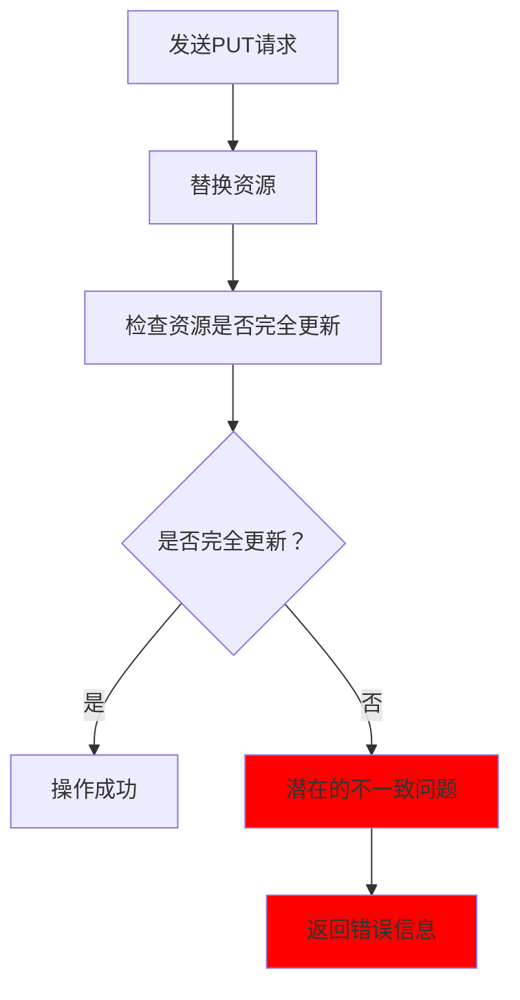
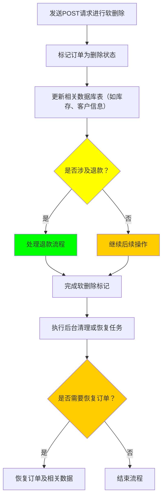
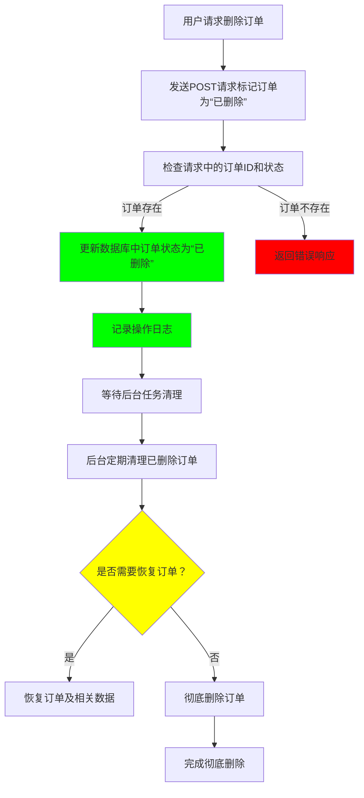
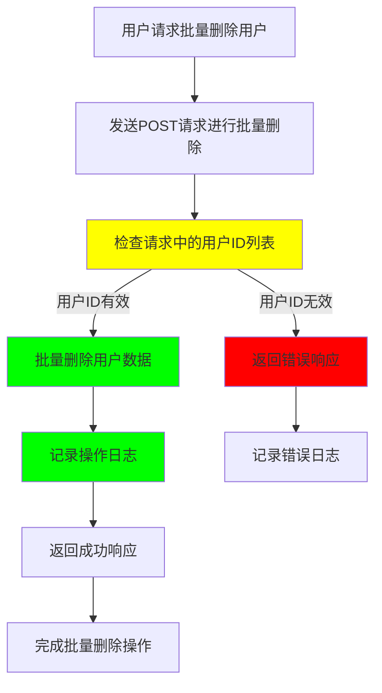
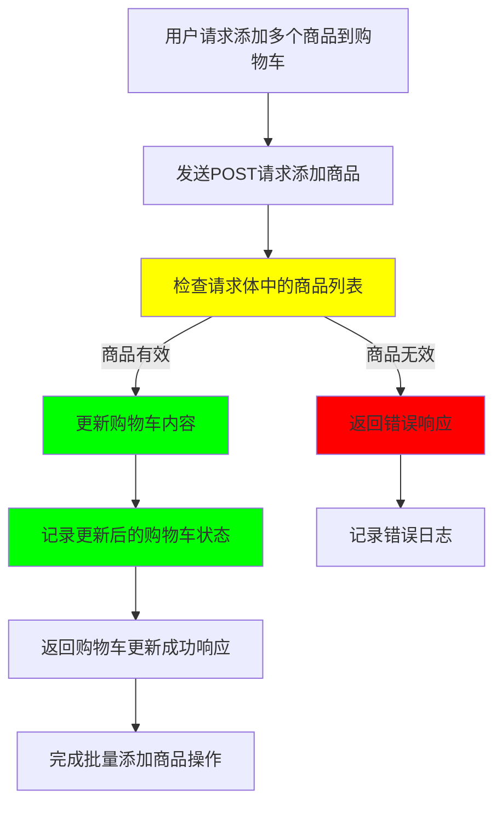
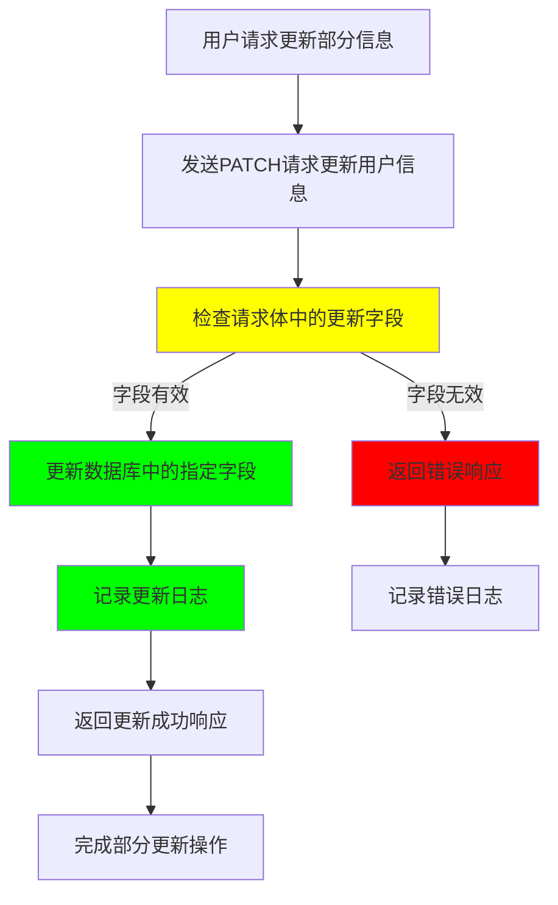
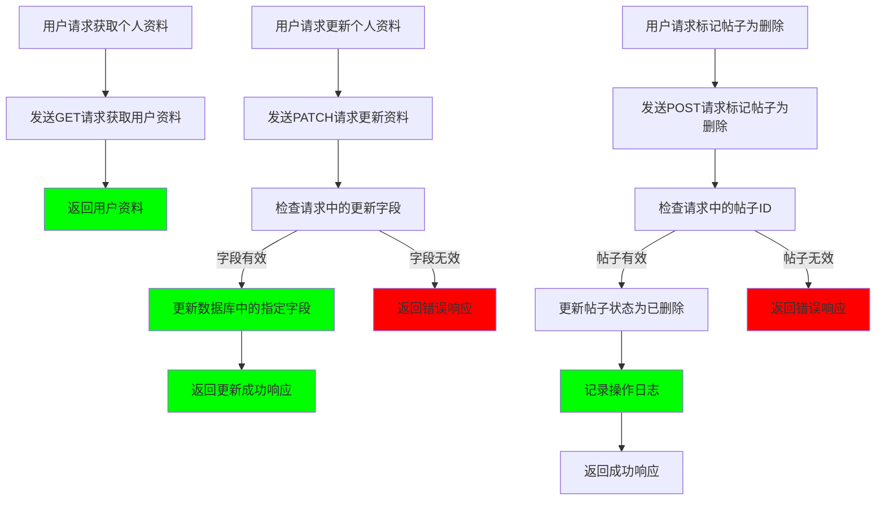
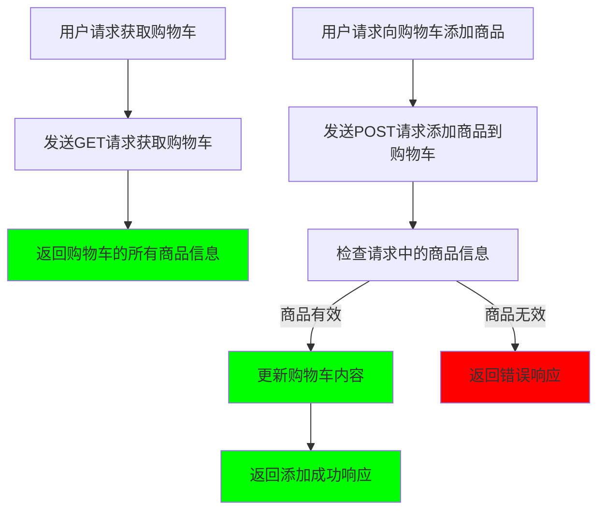
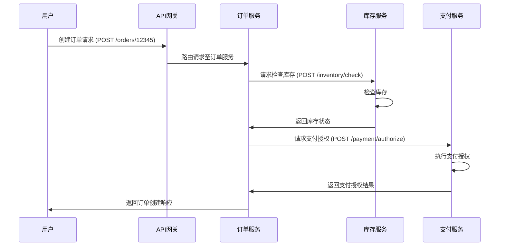
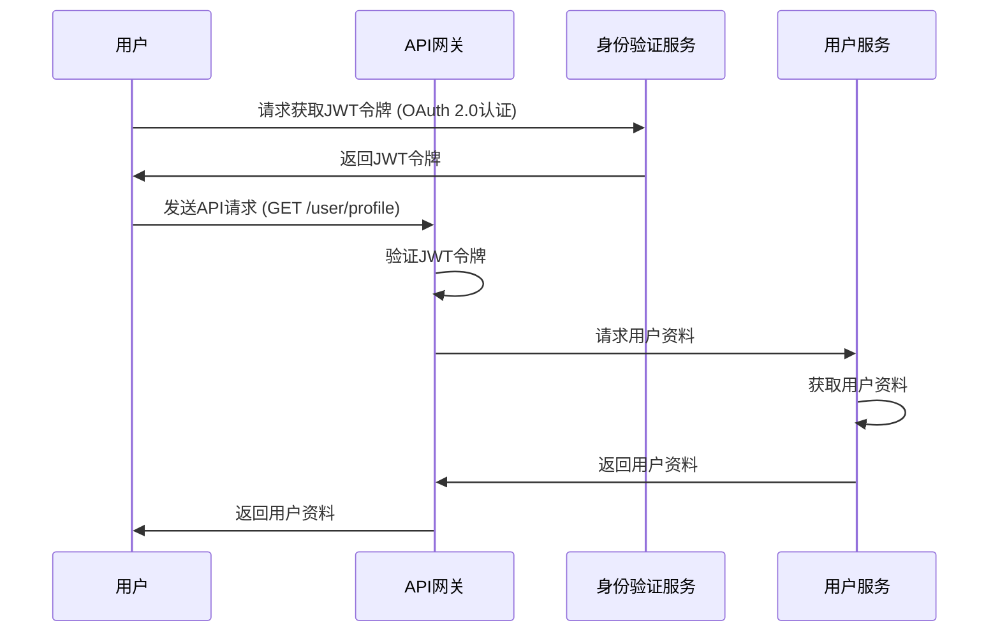

# HTTP 协议中 GET 和 POST 方法详解

## 一、 GET 请求报文分析

1. **请求行**
   * **请求方法**：`GET`（描述该请求采用的方法）。*注：HTTP/1.1 协议最初定义了 8 种方法（GET, POST, PUT, DELETE, HEAD, OPTIONS, TRACE, CONNECT），后续扩展了 PATCH 等。*
   * **URI (统一资源标识符)**：请求 WEB 服务器的资源名称。例如：`/PrjTheHttpProtocol/test?username=admin&userpassword=123`。
     * **说明**：HTTP 协议规定 GET 请求发送的数据包含在 URI 中，格式为 `uri?name=value&name=value...`。
     * **URL (统一资源定位符)**：不仅代表资源名称，还能通过它找到该资源。例如：`http://ip:port/URI`。
   * **协议版本**：`HTTP/1.1`（当前主流使用的 HTTP 协议版本之一）。
2. **请求报头**
   * 包含浏览器接收的语言版本、WEB 服务器的 IP 地址和端口号、Cookies 等信息。
3. **空白行**
   * 用于分割请求报头和请求体的专用行（`\r\n`）。
4. **请求体**
   * 由于当前使用的是 GET 请求方式，通常请求体中不传送任何数据。

---

## 二、 POST 请求报文分析

1. **请求行**
   * 与 GET 方法类似，包括请求方法 (`POST`)、URI、协议版本。区别在于采用 POST 方式时，URI 后面通常不附带传递的数据参数。
2. **请求报头**
   * 包含常规报头信息，可能显示缓存控制如 `Cache-Control: no-cache`，并且通常包含 `Content-Type` 和 `Content-Length` 以描述请求体的数据类型和长度。
3. **空白行**
   * 分割请求报头和请求体的专用行。
4. **请求体**
   * POST 请求的数据在请求体中发送。默认的表单提交格式通常是 `application/x-www-form-urlencoded`（即 `name=value&name=value...`），也可通过修改请求报头中的 `Content-Type` 指定为其他格式（如 `application/json` 或 `multipart/form-data`）。

---

## 三、 响应报文分析

1. **状态行**
   * **协议版本**：如 `HTTP/1.1`。
   * **状态码**：如 `200`（响应状态号）。
   * **状态描述**：如 `OK`（对响应结果的简短描述）。
2. **响应报头**
   * 包含 WEB 服务器版本信息、内容类型 (`Content-Type`) 及字符编码、内容长度 (`Content-Length`)、时间戳、设置的 Cookies 等。
3. **空白行**
   * 分割响应报头和响应体的专用行。
4. **响应体**
   * 服务器返回的具体响应正文（如 HTML、JSON 数据等）。

---

## 四、 GET 和 POST 的核心区别

1. **发包次数（事实澄清）**
   * **常见误区**：许多文章称“GET 发送一次数据包，POST 发送两次”。
   * **事实核实**：HTTP 协议本身**并未规定** POST 必须分两次发送。这是部分浏览器（或客户端库处理带有 `Expect: 100-continue` 头的请求时）的特定底层 TCP 实现行为。现代大多数浏览器和网络环境下，POST 请求通常也是在一个 TCP 报文中将请求头和请求体一次性发送出去。
2. **缓存机制**
   * GET 请求的结果默认可以被浏览器缓存，且参数会保存在浏览器的历史记录中。
   * POST 请求的结果默认不进行缓存，且不会保存在浏览器历史记录中。
3. **参数携带位置**
   * GET 请求通过 URL（请求行）提交数据，参数在 URL 中明文可见。
   * POST 请求通过“请求体”传递数据，参数不会在 URL 中显示。
4. **数据长度限制**
   * **GET**：HTTP 协议规范并没有对 URI 长度进行限制。实际的长度限制来源于**浏览器和 WEB 服务器的实现**。
   * **POST**：理论上和协议规范上都没有大小限制。实际限制取决于**服务器的处理能力和配置**。

| 浏览器 / 服务器 | URL 最大长度限制参考（字符） |
| :--- | :--- |
| **Internet Explorer (IE)** | 2,083 个字符 |
| **Firefox / Chrome / Safari** | 通常在 8,000 到 65,536 个字符不等 |
| **Apache Server** | 默认接受最大长度约为 8,192 个字符 |
| **IIS** | 默认接受最大长度约为 16,384 个字符 |

> **服务器配置注意 (事实修正)**：在 Tomcat 中取消 POST 大小限制（默认通常为 2MB），对于 Tomcat 7.0.63 及更高版本，需要将 `server.xml` 中的 `maxPostSize` 属性设置为 **`-1`**（早期版本设为 `0` 代表无限制，新版设为 `0` 则表示限制为 0 字节）。

---

## 五、 GET 和 POST 使用上的关键问题

### 1. 本质上的区别：只读与写入
HTTP 协议的语义设计中：
* **GET**：应当是**安全且幂等**的，仅用于获取数据（查询）。它不应修改服务器资源。由于其幂等性，浏览器可以安全地对其进行缓存。
* **POST**：非幂等操作，用于向服务器提交数据（修改、新增资源）。相同的 POST 请求可能会在服务器端产生不同的副作用，因此不具备缓存意义。

### 2. 如何判断当前请求方式？
* 在浏览器地址栏直接输入 URL 访问，一定是 GET 请求。
* 点击页面上的普通超链接（`<a>` 标签），一定是 GET 请求。
* 使用 `<form>` 表单提交数据时，若 `method` 属性为空或指定为 `get`，则为 GET 请求。
* 使用 `<form>` 表单提交数据且 `method` 属性被显式指定为 `post`，则为 POST 请求。

### 3. 选择指南与安全性
* **选择标准**：首先判断操作是否会修改服务器资源。如果是增删改等操作，或数据包含敏感私人信息（如密码），**必须使用 POST**。如果仅是简单的条件查询，应使用 GET。
* **安全性解析**：从防窃听（网络抓包）角度看，GET 和 HTTP 下的 POST **都不安全**（均为明文）。真正的安全依赖于 HTTPS 加密传输。但在业务层面上，GET 将参数暴露在 URL 中，更容易通过屏幕偷窥、服务器日志泄露或浏览器历史记录泄露敏感信息，因此在传递敏感数据时 POST 优于 GET。

### 4. 误用的危害
* **应使用 GET 却用了 POST**：违背 RESTful 语义，破坏了客户端（浏览器、CDN 等）的合理缓存机制，导致性能受损。
* **应使用 POST 却用了 GET**：暴漏敏感操作在 URL 中，存在严重的安全隐患（例如被轻易诱导点击发起跨站请求伪造 CSRF 攻击等）。服务端应当在代码层面严格限制接口的请求方法，拒绝不符合语义的 GET 请求修改数据。


## 第一章：PUT与DELETE请求的基本作用                                                                                                       

在HTTP协议中，PUT和DELETE请求是用于修改和删除资源的常见方法。它们在RESTful API的设计中扮演着重要角色，但近年来，随着API设计的不断演进，越来越多的开发者开始避免使用这两种请求方法，转而使用其他替代方案。在探讨为何这些请求方法被逐渐弃用之前，我们先来回顾一下它们的基本作用和用法。 

### 1.1 PUT请求的基本作用

**PUT请求**是HTTP协议中用于更新资源的请求方法。根据RESTful架构的理念，PUT请求会将指定的资源替换成请求中提供的新内容。PUT的设计目的是确保资 源的完整替换。也就是说，如果你对某个资源进行PUT操作，客户端会将整个资源的内容提交给服务器，服务器会用这个新内容完全替换掉旧的资源。        

**示例：** 假设我们有一个用户信息资源，存储在 `/users/{userId}` 这个路径下，使用PUT请求更新用户信息的操作如下：

```
PUT /users/12345 HTTP/1.1
Content-Type: application/json
{
  "name": "Alice",
  "email": "alice@example.com",
  "age": 30
}
```

在这个示例中，PUT请求会用请求体中的数据完全替换 `/users/12345` 这个资源。如果该用户的资源本来有某些字段缺失，PUT请求的到来将会覆盖原有的内 容，使得用户信息被替换为请求中提供的新数据。

### 1.2 DELETE请求的基本作用

**DELETE请求**用于删除指定资源。在RESTful架构中，DELETE方法的语义是“删除资源”。与PUT请求类似，DELETE请求也是直接作用于资源本身，因此它通常 会删除服务器上的数据。

**示例：** 假设我们要删除某个用户的信息，可以通过发送DELETE请求至 `/users/{userId}` 来执行该操作：

```
DELETE /users/12345 HTTP/1.1
```

该请求会删除ID为 `12345` 的用户资源。在删除操作后，如果请求成功，服务器通常会返回状态码 `204 No Content`，表示删除操作已成功执行，且没有返 回任何内容。

### 1.3 RESTful API的定义与设计理念

REST（Representational State Transfer）是一个面向资源的架构风格，它将Web应用程序视为由一组资源组成的系统。每个资源都可以通过URL唯一标识，而HTTP请求（如GET、POST、PUT、DELETE等）则用于对这些资源执行操作。

在RESTful API设计中，HTTP方法与资源操作之间的映射非常明确：

* **GET**：用于获取资源
* **POST**：用于创建资源
* **PUT**：用于完全更新资源
* **PATCH**：用于部分更新资源
* **DELETE**：用于删除资源

这种明确的映射能够提高API的可理解性和一致性。然而，在实际应用中，PUT和DELETE方法虽然具备了功能性，但它们也存在一些限制和潜在的问题，这些问 题在后续章节中将进一步探讨。

## 第二章：为什么大公司逐渐避免使用PUT和DELETE？

尽管PUT和DELETE请求在RESTful API中具有明确的语义和作用，近年来，许多大公司和现代API设计中逐渐避免使用这些请求方法。原因主要来自于它们在实际应用中的一些缺点，尤其是在复杂的业务场景和高并发的环境下。以下是一些关键因素，解释了为什么PUT和DELETE请求在大公司中不再广泛使用。

大公司逐渐避免使用PUT和DELETE请求，主要是出于以下原因：

* **幂等性问题**：在高并发环境中，PUT和DELETE请求的幂等性难以保障，可能会导致资源状态不一致。
* **复杂的错误处理和回滚机制**：特别是在分布式系统中，回滚操作变得极为复杂。
* **灵活性和易用性**：POST和PATCH等请求方式相比PUT和DELETE更具灵活性，能够更好地适应现代复杂业务需求。
* **安全性风险**：直接修改或删除资源的操作增加了安全隐患，导致更多的审计和权限管理需求。

### 2.1 幂等性问题

**幂等性**是指多次执行相同操作会产生相同结果。理论上，PUT和DELETE请求是幂等的——即执行一次和多次应该没有不同的效果。对于PUT请求，多次调用同 一资源并提交相同的数据应该不会改变资源的状态；对于DELETE请求，多次删除同一资源应该返回相同的结果，且资源不再存在。

然而，在实际操作中，幂等性往往面临挑战，尤其是在高并发和复杂操作的情况下。举个例子，当多个用户同时发出PUT请求更新同一资源时，可能会导致资源状态的不一致。相同的情况也可能出现在DELETE请求中，如果在删除操作的过程中发生了网络中断或其他异常，资源可能未能按预期删除。

**问题示例：**

假设你通过PUT请求更新某个用户的信息，但在执行过程中发生了网络延迟，导致请求被重复发送。尽管PUT请求应该是幂等的，但在某些情况下，这会导致资 源的状态不一致。比如，如果PUT请求是部分更新，而请求被重复发送，可能会无意中覆盖掉一些重要的字段，造成数据丢失或混乱。



### 2.2 错误处理和回滚机制复杂

对于PUT和DELETE请求，尤其是在涉及到数据库操作时，错误处理和回滚机制的实现非常复杂。

* **PUT请求**：如果PUT请求更新资源时发生错误，如何回滚到原来的状态就变得非常复杂。特别是在分布式系统中，跨多个服务和数据库进行资源更新时， 确保所有操作的原子性（即要么全部成功，要么全部失败）通常需要额外的事务管理或补偿机制。
* **DELETE请求**：删除资源是一项“破坏性”操作，一旦发生错误，恢复资源可能会变得非常困难。对于删除操作，大公司往往需要更严格的审计和恢复机制 ，以避免数据丢失。而DELETE请求的不可逆性使得这种操作的出错成本非常高。

**问题示例：**

如果在执行DELETE请求时发生网络中断，可能导致删除操作没有被完全执行。如果没有合适的回滚机制或者软删除策略，这将导致数据不可恢复，影响业务系 统的稳定性和可靠性。
  

### 2.3 API设计的灵活性和易用性

现代API设计越来越倾向于简化接口设计，提升灵活性和易用性。PUT和DELETE请求虽然具有明确的功能，但它们的使用在某些场景下显得过于严格，限制了开 发者的灵活性。

* **POST的优势**：POST请求在API设计中通常用来处理较为复杂的操作，且不局限于资源的创建。对于资源的更新、删除等操作，POST请求常常被用来替代PUT和DELETE方法。使用POST时，可以将操作封装在请求体中，避免了严格的“完全替换”或“删除”语义限制，给予了API设计更大的灵活性。
* **业务逻辑的复杂性**：现代业务系统通常具有更复杂的操作逻辑，涉及跨服务、跨模块的资源更新。此时，POST请求的灵活性使得它比PUT和DELETE更能适应这些复杂需求。POST请求不仅能用来创建资源，还可以用来执行复杂的业务操作，比如批量更新、删除标记（软删除）等。

**案例分析：**

在一个电商平台中，删除订单的操作可能涉及多个数据库表和系统状态的更新。如果直接使用DELETE请求，操作会非常复杂且难以保证数据的一致性。相反， 使用POST请求进行“软删除”标记，并通过后端进行后续清理和数据恢复，既保留了灵活性，又减少了风险。



### 2.4 安全性考虑

PUT和DELETE请求涉及对资源进行修改或删除，因此它们通常具有更高的风险，尤其是在资源敏感性较高的业务中。由于这些请求直接影响资源的状态，安全性成为了必须考虑的重要问题。

* **PUT请求**：PUT请求可能会导致不小心覆盖掉重要数据，特别是在权限验证不严格的情况下，恶意用户可能通过PUT请求篡改敏感信息。
* **DELETE请求**：DELETE请求的危险性更高，因为它会永久性地删除数据。如果权限控制和审计机制不够完善，恶意操作可能会导致数据丢失，造成无法恢 复的损失。

为了提高安全性，许多大公司在API设计时避免直接暴露PUT和DELETE请求，而是采用更安全的操作方式。例如，使用POST请求标记资源的删除操作，或通过带 有权限控制的PATCH请求更新资源，从而减少潜在的安全隐患。

## 第三章：替代方案和实践

在理解了为什么大公司逐渐避免使用PUT和DELETE请求后，接下来我们将探讨一些替代方案，以及如何在实际的API设计中应用这些方法，以提高系统的灵活性 、可扩展性和安全性。

为了避免PUT和DELETE请求带来的问题，很多大公司采用了以下替代方案：

* **PATCH请求**：用于部分更新资源，避免PUT的全量替换问题。
* **POST请求**：用于软删除操作，避免DELETE带来的不可恢复性问题。
* **非标准化使用**：在某些复杂的业务场景中，POST请求可以代替PUT和DELETE来执行复杂的操作。
* **幂等性与事务控制**：通过请求ID、事务和消息队列等机制，确保操作的一致性和幂等性。

这些替代方案使得API设计更加灵活、可靠，并且能够应对更复杂的业务需求和高并发场景。

### 3.1 PATCH请求的优势

**PATCH请求**作为一种更新资源的方式，具有比PUT更为灵活的特性。PATCH请求不是替换资源，而是对资源进行部分更新。这使得PATCH在处理大规模资源更 新时，能够减少不必要的数据传输，并且避免PUT带来的“完全替换”问题。

#### **优势：**

* **减少数据传输**：在更新资源时，仅需要提交要更新的部分，而不需要提交整个资源。这对于大型资源或者频繁更新的资源尤为重要。
* **更高的灵活性**：PATCH允许开发者精确控制需要更新的字段，避免了PUT中可能出现的意外覆盖。

**案例分析：**

假设我们有一个用户信息资源，其中包括“姓名”、“电子邮件”和“年龄”三个字段。在用PATCH请求更新用户的信息时，我们可以只更新其中的某个字段，而不需要发送整个用户信息。例如，如果我们只需要更新用户的电子邮件地址：

```
PATCH /users/12345 HTTP/1.1
Content-Type: application/json
{
  "email": "newemail@example.com"
}
```

这样，只有`email`字段会被更新，而不会影响到其他字段。这种方式既减少了网络流量，又避免了因为覆盖导致的错误。


### 3.2 使用POST请求替代DELETE（软删除）

虽然DELETE请求在RESTful架构中有着明确的语义，但是由于其不可逆的特性和潜在的安全隐患，许多大公司选择用**POST请求**来替代DELETE请求，尤其是在删除资源时。

这里的关键思想是使用“软删除”——即通过POST请求标记资源为已删除，而不是立即从数据库中删除该资源。这样，如果需要恢复资源，只需修改标记即可。   

**软删除的实现：**

* **标记删除**：通过POST请求将资源的`deleted`字段设置为`true`，并将其排除在常规查询之外。
* **延迟删除**：如果资源在一段时间内没有被恢复，系统可以通过后台任务在合适的时机执行实际的物理删除。

**案例分析：**

考虑一个电商平台中的订单删除功能。如果我们直接使用DELETE请求删除订单，那么订单会立即从数据库中消失，造成数据不可恢复。为了避免这种情况，我 们可以使用POST请求来标记订单为“已删除”：

```
POST /orders/12345/delete HTTP/1.1
Content-Type: application/json
{
  "status": "deleted"
}
```

这样，订单的状态字段被设置为`deleted`，但数据依然保留在数据库中，便于后续恢复或审计。在一段时间后，系统可以通过后台任务自动删除标记为已删除的订单。



### 3.3 API的非标准化使用

在一些复杂的企业级系统中，PUT和DELETE请求可能并不完全符合业务需求。为了满足特定需求，开发者可能会对这些HTTP方法进行“非标准化”的使用，结合业务逻辑来定义API操作。这种方法虽然不严格遵循RESTful规范，但在某些场景下能够更好地满足业务需求。

例如，有些系统可能会使用PUT请求来执行复杂的操作，而不仅仅是更新资源。为了避免过度依赖PUT和DELETE，开发者可以设计一些自定义的POST接口来执行 这些操作。例如，通过POST请求来创建、更新或删除多个资源。

**案例分析：**

在某些系统中，可能需要通过API执行批量操作，如批量更新用户信息或批量删除资源。在这种情况下，使用POST请求比PUT或DELETE更具灵活性，因为它允许 开发者将复杂的操作封装在一个请求中。例如，批量删除用户：

```
POST /users/delete HTTP/1.1
Content-Type: application/json
{
  "userIds": [12345, 67890, 11223]
}
```

这种设计允许开发者在一个请求中传递多个删除的用户ID，避免了直接使用DELETE请求进行单个资源的删除。



### 3.4 幂等性与事务控制

在高并发环境下，确保API操作的幂等性非常重要。幂等性是指多次执行相同操作会产生相同结果，避免因重复请求导致不一致的资源状态。为了确保操作的幂等性，许多大公司会采用一些额外的技术手段，如**事务管理**、**消息队列**、**缓存机制**等。

对于PUT和DELETE请求，尽管它们是幂等的，但在分布式系统中，确保请求的幂等性通常需要额外的机制。例如，使用**唯一请求ID**来确保请求只被执行一次，或者使用**数据库事务**来保证数据的一致性。

**案例分析：**

假设我们有一个订单创建API，使用POST请求来创建新订单。为了确保订单的创建幂等性，可以使用**请求ID**来标识每一个创建请求。如果相同的请求ID被发送两次，系统会判断这是重复的请求，从而避免重复创建订单。

```
POST /orders HTTP/1.1
Content-Type: application/json
X-Request-ID: abc123
{
  "productId": 101,
  "quantity": 2
}
```

通过这种方式，即使网络问题导致请求被多次发送，订单也不会被重复创建。
   

## 第四章：使用POST、PATCH、GET等方法的优势

在现代API设计中，除了传统的PUT和DELETE请求外，POST、PATCH和GET请求常常成为更受欢迎的选择。这些请求方法不仅提供了更大的灵活性，还能帮助开发 者设计更高效、可扩展的系统。在这一章，我们将深入探讨这些方法的优势，并通过实际案例分析它们在替代PUT和DELETE请求时所带来的好处。

### 4.1 POST请求的优势

**POST请求**是最常用的HTTP方法之一，通常用于创建新资源。然而，POST请求的应用并不限于资源的创建。在许多复杂的操作中，POST请求能够比PUT和DELETE提供更高的灵活性。POST方法可以用来处理各种操作，包括：

* **创建资源**：用于创建新的数据对象。
* **复杂的业务逻辑处理**：在一个请求中执行多个操作。
* **软删除**：如前面所述，POST请求可以替代DELETE请求进行资源标记删除。
* **批量处理**：通过POST请求一次性处理多个资源的操作。

**案例分析：**

假设我们需要处理一个在线商店的购物车系统，客户可以将多个商品添加到购物车。为了避免多次调用PUT来更新购物车内容，使用POST请求能够将多个商品的添加操作封装在一次请求中。这种方式既减少了客户端与服务器之间的交互，也提高了系统的效率。

```
POST /cart/12345/items HTTP/1.1
Content-Type: application/json
{
  "items": [
    { "productId": 101, "quantity": 2 },
    { "productId": 202, "quantity": 1 }
  ]
}
```

通过POST请求，我们能够一次性将多个商品添加到购物车，避免了多次请求带来的性能损失。



### 4.2 PATCH请求的优势

相比于PUT，**PATCH请求**提供了更为精细的更新控制。PATCH通常用于部分更新资源，而不像PUT那样完全替换资源。PATCH方法仅发送需要更新的数据，减少了网络带宽的消耗，并且避免了PUT请求可能带来的数据覆盖问题。

**优势：**

* **部分更新**：PATCH只传输需要更新的部分字段，相比PUT发送整个资源，减少了数据传输量。
* **更小的更新粒度**：对于大规模的数据结构，可以更精准地控制更新的内容，避免不必要的全量更新。
* **性能优化**：减少了服务器的计算负担，因为PATCH只需要修改一部分数据，而不需要重新处理整个资源。

**案例分析：**

假设我们有一个大型用户数据库，每个用户的资源可能包含数百个字段。假如用户仅需要更新“姓名”和“电子邮件”字段，而PUT请求会导致整个用户信息资源的更新，造成大量无意义的数据传输。这时，PATCH请求则更加高效：

```
PATCH /users/12345 HTTP/1.1
Content-Type: application/json
{
  "name": "Bob",
  "email": "bob@example.com"
}
```

这种方法确保只发送需要更新的字段，极大地减少了网络流量和服务器计算的压力。



### 4.3 GET请求的优势

**GET请求**是最常见的HTTP请求方法之一，通常用于从服务器获取资源。GET请求的优势在于它是无副作用的，也就是说，GET请求不会对资源进行修改，因此非常适合用来进行数据查询操作。

**优势：**

* **无副作用**：GET请求不会对服务器资源进行任何修改，适用于获取数据和资源。
* **缓存友好**：GET请求可以利用缓存机制，减少对服务器的压力。
* **性能高效**：由于GET请求仅进行数据读取，不涉及资源的修改，因此它通常比其他修改类型的请求（如POST、PUT、DELETE）更高效。

**案例分析：**

在一个新闻网站中，用户通过GET请求获取新闻文章列表。由于GET请求的无副作用特性，客户端可以缓存这些数据，避免每次加载页面时都请求服务器，从而 提高用户体验并减少服务器负担。

```
GET /articles HTTP/1.1
```

通过合理利用GET请求和缓存机制，系统能够减少对服务器的请求次数，提高响应速度。

### 4.4 总结：POST、PATCH、GET的优势

| **请求方法** | **用途** | **优势** |
| --- | --- | --- |
| **POST** | 创建资源、复杂业务操作、批量处理 | 高灵活性，支持复杂操作，适合处理大规模请求和软删除 |
| **PATCH** | 部分更新资源 | 减少数据传输，适合部分更新和性能优化 |
| **GET** | 获取资源 | 无副作用，缓存友好，性能高效 |

### 4.5 实际应用中的组合使用

在实际开发中，POST、PATCH和GET请求常常是组合使用的。例如，在用户信息更新的场景中，我们可以使用GET请求来获取用户信息，使用PATCH请求来更新部 分信息，使用POST请求来处理复杂的业务逻辑或删除操作。这种方法既能确保API的清晰与可扩展性，又能灵活应对不同业务需求。

**案例分析：**

在一个社交平台中，用户可能会进行以下操作：

* **GET请求**：获取个人资料和帖子。
* **PATCH请求**：更新个人资料的某些字段（如用户名、头像）。
* **POST请求**：创建新帖子，标记删除帖子（软删除）等。

```
GET /users/12345 HTTP/1.1  // 获取用户资料

###
PATCH /users/12345 HTTP/1.1  // 更新用户资料

###
POST /posts/12345/delete HTTP/1.1  // 标记帖子为删除
```

这种方式确保了API的灵活性和易扩展性，同时也能保证系统的高效性。



---

## 第五章：大公司API设计趋势与实践

随着微服务架构的普及和系统规模的不断扩大，大公司在API设计上的需求越来越复杂。API不仅需要处理大量的并发请求，还需要适应不同的业务需求、快速 迭代以及高安全性的要求。在这一章中，我们将分析当前大公司API设计的主要趋势和实践，特别是如何避免直接使用PUT和DELETE请求，并通过一些最佳实践 来提升API的质量、可靠性和可维护性。

### 5.1 无状态与状态管理

在大规模的分布式系统中，\*\*无状态（Stateless）\*\*是API设计中的一个重要概念。无状态意味着每个API请求都应当包含足够的上下文信息，而不依赖于服务器端的状态存储。无状态的设计方式有助于提升系统的扩展性和可维护性，因为每次请求都可以独立处理，不会因为状态的变化而增加系统复杂性。     

**无状态设计的优势：**

* **易于扩展**：无状态的设计让系统更容易横向扩展，能够灵活处理大量并发请求。
* **容错性高**：每个请求都是独立的，若某个请求失败，不会影响到其他请求。
* **简化调试和测试**：无状态设计降低了因依赖上下文而导致的调试复杂度。

**案例分析：**

在一个典型的电商平台中，用户的购物车通常是一个很复杂的资源，它可能需要存储大量的商品信息。如果将购物车设计为无状态，每次请求都传递所有购物 车的状态信息（如商品、数量、价格等）。这样，不管购物车是存储在服务器的哪个实例中，都可以通过请求中的信息恢复购物车的状态。

```
GET /cart/12345 HTTP/1.1  // 获取购物车
POST /cart/12345/items HTTP/1.1  // 向购物车添加商品
```

这种无状态设计方式使得购物车的数据存储可以更加灵活，且更容易支持分布式和负载均衡。



### 5.2 版本管理与迁移

随着业务需求的变化，API的版本控制变得至关重要。大公司往往面临着旧版本API与新版本API的并行运行问题，如何平滑地进行版本迁移，确保系统的兼容性和可靠性，是设计API时必须考虑的一个问题。

**API版本管理策略：**

* **URL版本控制**：在API的URL中明确指定版本号，如 `/v1/users` 和 `/v2/users`，这是最常见的版本控制方式。
* **请求头版本控制**：通过在请求头中指定API版本号，允许客户端和服务器根据请求头来选择使用哪个版本的API。
* **无版本化API**：采用基于特性或动态路由的版本控制方式，避免版本号的硬编码，使API能够根据请求内容和业务需求动态适配。

**案例分析：**

假设在一个电商平台中，我们需要对订单API进行升级。为了避免影响现有的客户端，我们可以通过在URL中加入版本号来区分新旧版本：

```
GET /v1/orders/12345 HTTP/1.1  // 旧版本API
GET /v2/orders/12345 HTTP/1.1  // 新版本API
```

通过版本化管理，我们可以在不影响现有用户的情况下，平滑地引入新功能和改进。


### 5.3 微服务与服务拆分

随着微服务架构的普及，大公司逐渐将单一的后端系统拆分成多个独立的小服务，每个服务负责不同的业务领域。每个微服务通过API与其他服务进行通信。微服务架构使得每个服务可以独立开发、部署和扩展，但也带来了API设计的挑战，特别是在API的集成和治理上。

**微服务API设计的挑战：**

* **跨服务通信**：微服务之间需要通过API进行通信，如何设计高效、可靠的API至关重要。
* **API网关**：为了简化微服务的访问，很多公司会使用API网关来统一处理请求、路由和身份验证等工作。
* **数据一致性问题**：微服务之间的分布式数据管理使得数据一致性成为一大挑战，如何保证跨服务操作的一致性需要额外的机制，如事件驱动架构（EDA）和分布式事务。

**案例分析：**

在一个电商平台中，订单服务、库存服务和支付服务通常是独立的微服务，它们通过API进行通信。如果用户下单，订单服务需要调用库存服务来确认商品的库存，支付服务来确认支付，并最终生成订单。这种多服务的通信需要通过API网关来进行统一管理和路由。

```
POST /orders/12345 HTTP/1.1  // 创建订单
POST /inventory/check HTTP/1.1  // 检查库存
POST /payment/authorize HTTP/1.1  // 支付授权
```

通过微服务架构，电商平台可以更加灵活地扩展各个业务模块，提高系统的可维护性和可伸缩性。



### 5.4 安全性与权限管理

API的安全性是大公司在设计API时必须考虑的重要因素。API往往会暴露大量的敏感数据和业务逻辑，如何保护API免受恶意攻击、如何管理不同角色和权限的 访问，是设计时的重点。

**常见的API安全性策略：**

* **身份认证**：通过OAuth、JWT等机制验证请求者的身份。
* **权限控制**：通过RBAC（基于角色的访问控制）等策略，确保只有授权的用户能够访问特定的API。
* **请求验证**：使用API网关进行请求验证，过滤恶意请求和SQL注入等攻击。
* **数据加密**：传输过程中使用SSL/TLS加密，确保数据的安全。

**案例分析：**

在一个金融平台中，用户的数据非常敏感，因此API的安全性至关重要。该平台使用OAuth 2.0来实现用户身份验证，并通过JWT令牌管理用户的会话。每个API 请求都需要附带一个JWT令牌来验证用户身份，并根据用户角色控制对资源的访问权限。

```
GET /user/profile HTTP/1.1  // 获取用户资料
Authorization: Bearer <JWT_Token>
```

通过这种安全机制，平台能够保护用户数据，并确保只有授权用户才能访问敏感资源。



---

## 第六章：总结与未来展望

随着技术的不断发展和需求的不断变化，API设计已经不仅仅是一个技术问题，它关系到系统的可维护性、扩展性、安全性等多个方面。在过去的几章中，我们讨论了PUT和DELETE请求逐渐被弃用的原因，以及如何通过POST、PATCH、GET等请求方法来替代它们，提升系统的灵活性和性能。同时，我们也探讨了大公司在API设计中的趋势和最佳实践，包括无状态设计、版本管理、微服务架构、安全性管理等。

### 6.1 PUT和DELETE的替代趋势

在实际应用中，PUT和DELETE请求的替代并不是完全排斥这两种方法，而是根据不同的场景选择更合适的HTTP方法。POST、PATCH和GET提供了更加灵活、可扩展的替代方案，尤其是在微服务架构和高并发的环境下，它们能够更好地满足业务需求。

* **POST请求**：不仅仅用于资源的创建，还广泛用于复杂的业务逻辑处理、批量操作和软删除等场景。它的灵活性使得API设计更加高效。
* **PATCH请求**：适合用于部分更新，尤其是在处理大型资源时。它减少了数据传输量，避免了PUT的全量更新问题。
* **GET请求**：用于数据查询，其无副作用和高效的性能使其成为API设计中的基础。

尽管这些替代方法在实践中逐渐占据主导地位，但PUT和DELETE请求依然可以在某些情况下发挥作用。关键在于合理的场景选择，以及如何通过合适的API设计 来满足业务需求。

### 6.2 API设计的灵活性与扩展性

现代系统要求API具备较高的灵活性和扩展性，尤其是在微服务架构中，服务的独立性和可扩展性对系统的稳定性和性能至关重要。API设计的灵活性不仅仅体 现在方法选择上，还体现在版本管理、数据传输方式、错误处理、权限控制等多个方面。

* **版本管理**：随着系统的演进和业务需求的变化，API的版本管理变得尤为重要。大公司通常采用URL版本控制或请求头版本控制的方式，确保不同版本的API能够平滑过渡，避免影响现有用户。
* **数据传输方式**：为了提高API的性能，许多大公司采取了JSON、Protobuf等高效的数据传输格式。同时，在一些特定场景下，GraphQL等更加灵活的查询 语言也开始被广泛使用，允许客户端根据需求获取数据，进一步提升了API的灵活性。
* **错误处理与回滚机制**：在高并发和分布式环境下，API的错误处理和回滚机制显得尤为重要。通过合理设计重试机制、幂等性控制和事务管理，开发者可以最大程度地减少因系统错误或请求重复导致的问题。

### 6.3 API安全性与合规性

随着数据泄露事件频发和隐私法规（如GDPR）的实施，API的安全性和合规性成为开发者必须关注的重点。API不仅需要抵御外部攻击，还需要确保内部访问权 限的管理和审计追踪。

* **身份验证与授权**：OAuth 2.0、JWT等身份认证机制在大公司API中得到了广泛应用，通过令牌（Token）验证请求者的身份，从而避免了传统的基于用户 名和密码的认证方式带来的风险。
* **数据加密与传输安全**：通过HTTPS和TLS加密协议，确保API的传输过程中的数据不会被窃取或篡改。同时，对敏感数据（如用户密码、信用卡信息等）进行加密存储，以增加数据安全性。
* **API网关与监控**：API网关不仅用于路由请求，还可以进行身份验证、请求限制、速率控制等安全控制。此外，使用监控工具实时监控API的访问情况和异常，能够帮助开发团队快速发现潜在的安全风险。

### 6.4 微服务架构下的API治理

随着微服务架构的兴起，API的管理和治理变得更加复杂。每个微服务都有自己的API，如何有效地管理和协调这些API，以保证它们能够高效、安全地运行，成为一个关键问题。

* **API网关**：API网关作为微服务的入口，统一处理所有来自客户端的请求，并将其转发到相应的微服务。API网关能够简化客户端的访问逻辑，并且为API 的安全性、权限控制、路由、负载均衡等提供统一的管理。
* **服务发现与负载均衡**：随着微服务数量的增加，服务发现和负载均衡机制也显得尤为重要。使用如Consul、Eureka等工具，微服务可以动态注册和发现 ，保证系统的可扩展性和容错能力。
* **事件驱动架构（EDA）**：在微服务间，数据的传递不一定依赖于同步的API调用，事件驱动架构通过异步事件通知其他服务，减少了服务间的耦合，提高 了系统的弹性。

### 6.5 智能化与自动化API设计

随着AI、机器学习等技术的发展，API设计和管理可能会变得更加智能化。未来的API设计将不仅仅依赖于传统的手工开发和配置，更多的自动化工具和智能化 决策将参与到API的设计和优化过程中。

* **智能API设计工具**：基于AI的API设计工具能够自动根据需求和业务场景生成高效的API接口，减少人工设计和调试的时间。
* **自动化测试与优化**：通过机器学习分析API的使用模式，自动化测试工具能够根据API的实际使用情况进行性能优化，并自动修复潜在的漏洞和性能瓶颈 。
* **无服务器架构（Serverless）**：无服务器架构通过自动扩展计算资源，减少了开发者在API部署过程中的运维工作。在未来，API的托管和扩展可能会更 加依赖于无服务器技术，以减少资源浪费和运维成本。